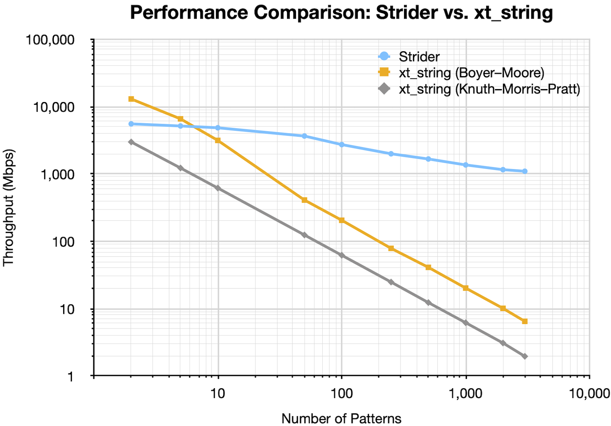
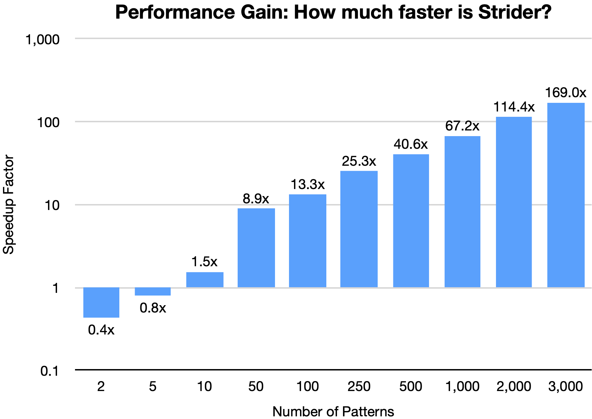

# Strider

Strider accelerates multi-pattern string matching in Linux Netfilter using the Aho-Corasick algorithm. It provides a
scalable, dynamic alternative to [
`xt_string`](https://man7.org/linux/man-pages/man8/iptables-extensions.8.html#:~:text=the%20nth%20mode.-,string,-This%20module%20matches),
capable of handling thousands of runtime-updatable patterns with minimal overhead.

## Why Strider?

The native `xt_string` scales poorly because it matches patterns one by one. Strider uses the Aho-Corasick algorithm to
match **all patterns at once** in a single pass.

What's worse, `xt_string` forces a trade-off between **speed** (Boyer-Moore, which misses patterns split across
fragments) and **correctness** (Knuth-Pratt-Morris, reliable but extremely slow).

**Strider gives you both.** It provides the correctness of KMP (never missing fragmented patterns) with performance that
eclipses even the fast Boyer-Moore algorithm.

<p align="center">
    
    
</p>

**Key Takeaways:**

1. **Unmatched Scalability**: Strider maintains above 1 Gbps throughput even with 3,000 patterns, delivering a
   **558.7x** speedup over `xt_string` (which collapses to an unusable 1.96 Mbps in the "reliable" KMP mode).
2. **No "Safety Tax"**: Strider matches KMP's reliability guarantees (handling fragmentation) while delivering superior
   performance for any non-trivial ruleset (>1 pattern).
3. **Low Break-Even Point**: Even against the "fast but unreliable" Boyer-Moore algorithm, Strider takes the lead once
   your ruleset exceeds just **~7** patterns.

## Installation

### Dependencies

- Kernel headers and build tools
- GNU Autotools (Autoconf, Automake, Libtool)
- Generic Netlink library (libnl-genl)
- Xtables development files

On a Debian-based system, these can be installed with:

```shell
sudo apt update
sudo apt install build-essential pkg-config \
    linux-headers-$(uname -r) \
    autoconf automake libtool \
    libnl-3-dev libnl-genl-3-dev \
    libxtables-dev
```

### Build and Install

1. Pre-configure:
    ```shell
    autoreconf -i
    ```
2. Configure, build, and install:
    ```shell
    ./configure
    make
    sudo make install
    ```
3. Update the kernel's module dependency list:
    ```shell
    sudo depmod -a
    ```

## Example Usage

1. **Create a pattern set**

   Patterns live in named sets. Let's create one called "blocklist":

    ```shell
    sudo striderctl create blocklist
    ```

2. **Add patterns to the set**

   Patterns can be added as simple strings or as hex-encoded bytes:

    ```shell
    # Add a simple string pattern
    sudo striderctl add blocklist "evil-pattern"

    # Add a pattern with mixed hex and ASCII: "GET /malicious"
    sudo striderctl add blocklist --hex "GET /|6d616c6963696f7573|"
    ```

3. **Use the set in an iptables rule**

   Drop any TCP packets on port 80 containing patterns from "blocklist":

    ```shell
    sudo iptables -A INPUT -p tcp --dport 80 -m strider --match-set blocklist -j DROP
    ```

   Any new patterns added to "blocklist" will be enforced by this rule immediately, without needing to reload the
   firewall.

4. **Cleanup**

   To remove the rule and the pattern set:

    ```shell
    # Remove the iptables rule
    sudo iptables -D INPUT -p tcp --dport 80 -m strider --match-set blocklist -j DROP

    # Destroy the set
    sudo striderctl destroy blocklist
    ```
